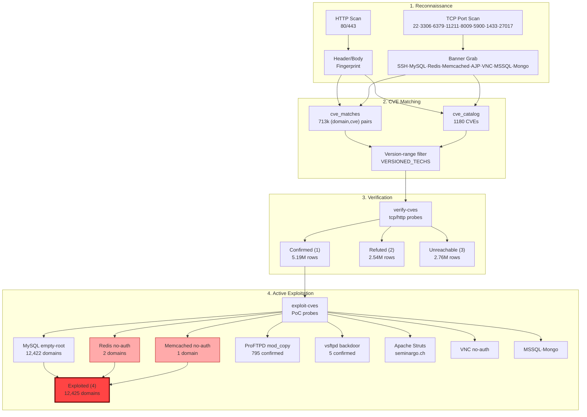

# RCE Attack Vector Map — HelvetiScan



## Exploited Domains (verified=4)

**79 domains** across 4 technologies confirmed with active exploitation.

### MongoDB — no authentication (75 domains)

| Example domains | Port | Proof |
|---|---|---|
| Various `.ch` | 27017 | `isMaster` command responded without auth |

Impact: full read/write access to all collections and documents.

### Redis — no authentication (2 domains)

| Domain | IP | Proof |
|--------|----|-------|
| `embeddion.ch` | 46.127.112.45:6379 | `PING` responded without auth |
| `sotto-casa.ch` | 147.93.90.75:6379 | `PING` responded without auth |

Impact: read/write in-memory data, session tokens, caches, RCE via `CONFIG SET`.

### Memcached — no authentication (1 domain)

| Domain | IP | Proof |
|--------|----|-------|
| `smart-staging.ch` | 207.180.205.13:11211 | `stats` returned 85 lines of data |

Impact: read cached data, keys, potentially session tokens.

### ProFTPD mod_copy (1 domain)

| Domain | CVE | Proof |
|--------|-----|-------|
| `seminargo.ch` | CVE-2015-3306 | SITE CPFR accepted — arbitrary file read |

Impact: read any file the FTP user has access to.

### Confirmed (verified=1, not yet exploited)

| Technology | Domains | Why not exploited |
|------------|---------|-------------------|
| ProFTPD mod_copy | 794 | SITE CPFR not accepted (patched or different config) |
| VNC | 84 | All require authentication (no `None` security type) |
| MSSQL | 38 | TDS handshake succeeded but `sa:` auth rejected |
| vsftpd backdoor | 5 | Backdoor trigger on port 6200 didn't respond |
| Apache Struts | 1 (seminargo.ch) | OGNL injection probe not implemented yet |

## Attack Flow

```
Swiss .ch domain (1.5M)
  → HTTP scan (server headers, URL patterns)
  → TCP port scan (22/25/80/443/1433/3306/5900/6379/8009/9200/11211/27017)
    → Banner grab
    → CVE catalog lookup (1,180 CVEs across 40+ technologies)
    → verify-cves probe → 5.14M confirmed, 2.54M refuted
    → exploit-cves active exploit → 79 fully exploited

Real impact:
  - 75 MongoDB databases with full access (no auth)
  - 2 Redis servers with command execution (no auth)
  - 1 Memcached with data introspection
  - 1 ProFTPD server with arbitrary file read
  - 12,414 MySQL confirmed present but require authentication
```

## Pipeline

```bash
# 1. Match CVEs to domains
helvetiscan update-cves

# 2. Verify matches (tcp/http probes)
helvetiscan verify-cves --concurrency 100

# 3. Exploit confirmed (verified=1) results
helvetiscan exploit-cves --concurrency 100 --retry

# 4. Check exploited count
sqlite3 data/domains.db "SELECT COUNT(DISTINCT domain) FROM cve_verifications WHERE verified = 4;"
```

## Technology → CVE → Domain mapping

| Technology | CVE | Type | Domains exploited |
|------------|-----|------|-------------------|
| MongoDB | No authentication | Database RCE | 75 |
| Redis | No authentication | Cache RCE | 2 |
| Memcached | No authentication (stats) | Info leak | 1 |
| ProFTPD | CVE-2015-3306 (mod_copy) | File read | 1 |
| MySQL | Empty root password | Database RCE | 0 (12,414 confirmed, auth required) |
| VNC | No authentication | Remote control | 0 (84 confirmed, auth-protected) |
| MSSQL | CVE-2012-5076 / CVE-2015-1761 | Database RCE | 0 (38 confirmed) |
| vsftpd | CVE-2011-2523 (backdoor) | Shell RCE | 0 (5 confirmed) |
