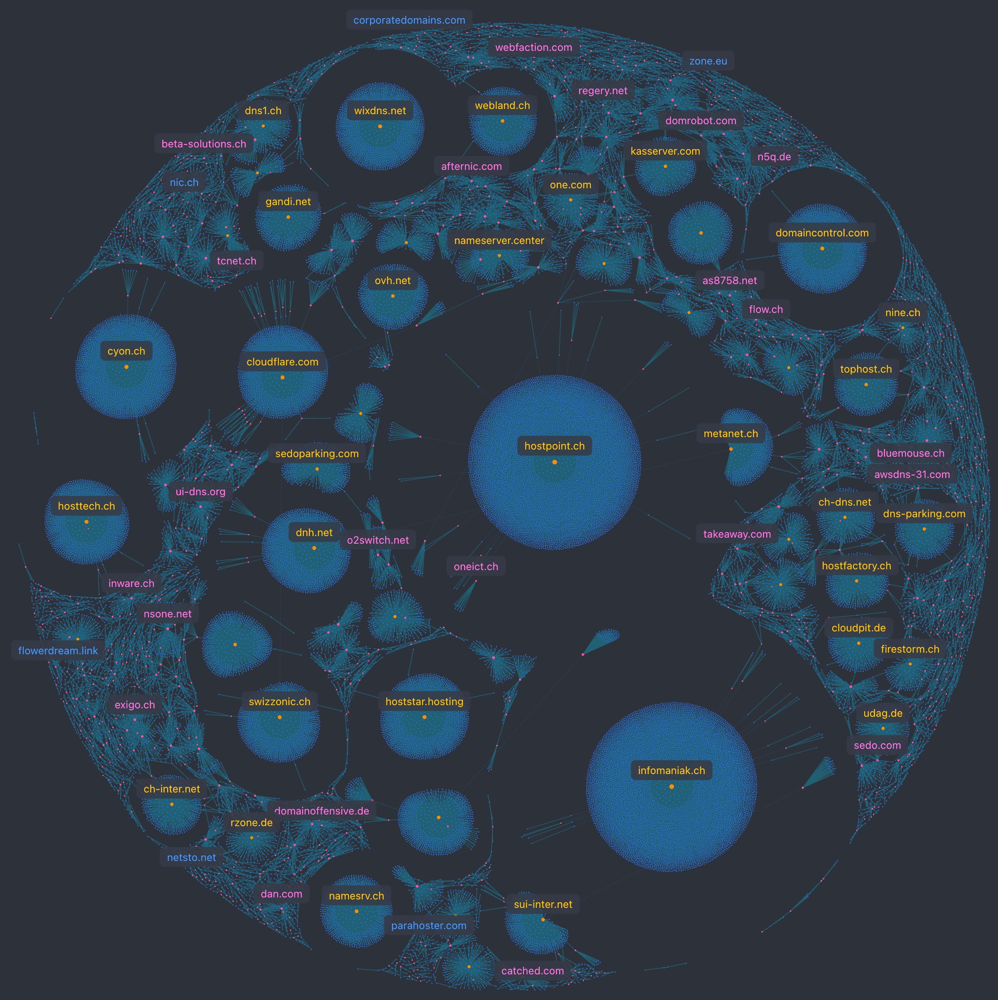

## HelvetiScan - Mapping the Swiss Digital Landscape

Scan, map and visualize the entire Swiss `.ch` namespace — over 2.5 million domains. A complete map of Switzerland's digital exposure - unpatched software, spoofable email, expired certificates, orphaned subdomains and beyond.

This public visualization exposes the DNS dependency structure as an interactive force graph. See it online [here](https://xn--2dk.xyz/dataviz/swiss/?maxPoints=50000&sim=1).

<div align="center">



</div>

 50k domains on the image. Change `maxPoints` URL parameter for ammount of nodes to visualize.

---

## What it scans

Seven modules, each covering a different layer of exposure:

| Module | What it checks |
|---|---|
| **TLS & Certificates** | Expiration, chain validity, key strength, TLS version, CT logs |
| **DNS & DNSSEC** | DNSSEC adoption, CAA records, zone transfers, open resolvers |
| **HTTP Security Headers** | HSTS, CSP, X-Frame-Options, Referrer-Policy, Permissions-Policy |
| **Open Ports** | Exposed databases, RDP, SMB, FTP, management interfaces |
| **Email Security** | SPF, DKIM, DMARC — spoofing readiness across the namespace |
| **Technology Fingerprinting** | CMS/framework detection, version extraction, CVE correlation |
| **Domain Protection** | WHOIS expiry, typosquats, homoglyphs, orphaned subdomains |


---

## How to use it?

```
Swiss internet scanner - HTTP, DNS, TLS and port intelligence for the .ch namespace

Usage: helvetiscan [OPTIONS] [COMMAND]

Commands:
  init         Populate domains.duckdb from a plain-text domain list (one domain/line)
  scan         HTTP scan: fetch status, title, server headers for all pending domains
  dns          Resolve DNS metadata for all domains missing a dns_info row
  tls          Scan TLS metadata for all domains missing a tls_info row
  ports        Scan a small fixed set of TCP ports for all domains missing a ports_info row
  subdomains   Discover subdomains via DNS zone transfer (AXFR) and NS/MX record harvest
  whois        Fetch WHOIS registrar and registration date for all domains
  update-cves  Fetch/refresh the CVE catalog from CISA KEV and seed built-in entries
  classify     Classify domains by industry sector using keyword heuristics
  benchmark    Compute sector-level risk benchmarks across classified domains
  help         Print this message or the help of the given subcommand(s)

Options:
      --domain <DOMAIN>  Scan only this single domain
      --all              Run HTTP, DNS, TLS, and ports scans together
      --db <DB>          [default: data/domains.duckdb]
      --full <FULL>      Full rescan shortcut using default arguments 
                         [possible values: domain, dns, tls, ports, subdomains, whois, all]
  -h, --help             Print this help
```

## Project structure

```
├── src/
│   ├── main.rs              # CLI entry point (clap subcommands, orchestration)
│   ├── shared.rs            # Shared types, constants, DNS resolver, SQL helpers
│   ├── schema.rs            # DuckDB schema initialisation
│   ├── http_scan.rs         # HTTP header analysis, CMS/server fingerprinting
│   ├── dns_scan.rs          # DNS resolution, DNSSEC, email security integration
│   ├── tls_scan.rs          # TLS certificate inspection
│   ├── ports_scan.rs        # Open port detection and banner grabbing
│   ├── subdomains.rs        # Subdomain discovery (DNS + CT logs)
│   ├── whois.rs             # WHOIS extraction and domain lifecycle tracking
│   ├── email_security.rs    # SPF / DKIM / DMARC policy analysis
│   ├── cve.rs               # CVE catalog and version-range matching
│   ├── classify.rs          # Domain sector/subsector classification
│   ├── benchmark.rs         # Performance benchmarks
│   └── tests.rs             # Unit tests
├── scan-modules/            # Per-module technical documentation (7 modules)
├── web/
│   ├── index.html           # Cosmograph visualisation
│   ├── serve.js             # Bun static file server
│   ├── nodes.arrow          # Pre-built graph data (served to browser)
│   └── edges.arrow
├── data/[^1]
│   ├── domains.duckdb       # Queryable database (DuckDB)
│   └── ...                  # Raw and intermediate data (gitignored)
```

---

## Research directions

What the project currently does: Maps the digital landscape → Scans for exposure → Analyzes vulnerabilities → Scores risk → Reports findings

The final database can answer questions such as:

- How many .ch domains depend on foreign infrastructure?
- Which .ch domains expose databases to the open internet?
- How many Swiss companies can have their email spoofed?
- How many .ch sites run software with known vulnerabilities?
- Which Swiss industries have the weakest security posture?
- How many Swiss domains expire in the next 30 days without auto-renewal?
- Which open ports appear most frequently across .ch?
- What's the most common CMS running on .ch domains?
- How many .ch mail servers use weak DKIM keys?
- Which Swiss cantons have the most exposed infrastructure?
- How many .ch domains have orphaned subdomains vulnerable to takeover?

See [domain analyses](analyses/analyse_domains.md)

## Planned Analyses

- **Sector patterns** — Which Swiss industries have the weakest security posture?
- **Attack surface clustering** — Do domains sharing infrastructure share vulnerabilities?
- **Supply chain exposure** — How many .ch sites are affected by a single vulnerable plugin?
- **Cascade modeling** — If the top 3 providers go down, how many domains go dark?
- **Trend detection** — Is DMARC adoption growing? Is DNSSEC adoption stalling?
- **Threat prediction** — Can new typosquat registrations signal incoming phishing campaigns?

[^1]: Data not published. Consider processed edges.arrow and nodes.arrow tables for dataviz.
