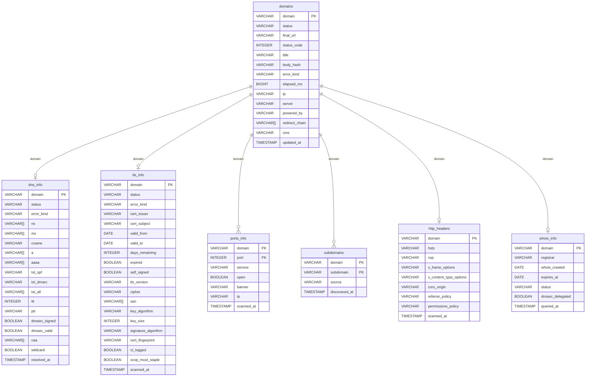

# Database Schema

`helvetiscan` writes into seven DuckDB tables and exposes one computed view.

## ER Diagram



## Table Reference

### `domains`

Populated by `helvetiscan scan`. One row per input domain.

| Column | Type | Notes |
|---|---|---|
| `domain` | VARCHAR PK | Canonical form, e.g. `example.ch` |
| `status` | VARCHAR | `ok` or `error` |
| `final_url` | VARCHAR | URL after redirect chain |
| `status_code` | INTEGER | Final HTTP status |
| `title` | VARCHAR | Extracted `<title>` text |
| `body_hash` | VARCHAR | MD5 of the truncated response body |
| `error_kind` | VARCHAR | See error kinds below |
| `elapsed_ms` | BIGINT | Total request time in ms |
| `ip` | VARCHAR | Resolved IP used for the request |
| `server` | VARCHAR | `Server:` response header |
| `powered_by` | VARCHAR | `X-Powered-By:` response header |
| `redirect_chain` | VARCHAR[] | Starting URL(s) when a redirect occurred |
| `cms` | VARCHAR | Detected CMS (WordPress, Drupal, Joomla, TYPO3, Wix) |
| `updated_at` | TIMESTAMP | Last scan time |

### `dns_info`

Populated by `helvetiscan dns`. Parallel A/AAAA/NS/MX/CNAME/TXT/CAA/DMARC/DNSKEY/DS/PTR lookups via Cloudflare.

| Column | Type | Notes |
|---|---|---|
| `domain` | VARCHAR PK | |
| `status` | VARCHAR | `ok` or `error` |
| `error_kind` | VARCHAR | See error kinds below |
| `ns` | VARCHAR[] | Nameserver hostnames |
| `mx` | VARCHAR[] | Mail exchanger hostnames |
| `cname` | VARCHAR | First CNAME target, if any |
| `a` | VARCHAR[] | IPv4 addresses |
| `aaaa` | VARCHAR[] | IPv6 addresses |
| `txt_spf` | VARCHAR | First TXT record starting with `v=spf1` |
| `txt_dmarc` | VARCHAR | First TXT record from `_dmarc.<domain>` |
| `txt_all` | VARCHAR[] | All TXT records (unfiltered) |
| `ttl` | INTEGER | Not yet populated (reserved) |
| `ptr` | VARCHAR | Reverse DNS of first resolved IP |
| `dnssec_signed` | BOOLEAN | True if DNSKEY or DS records exist |
| `dnssec_valid` | BOOLEAN | Reserved — chain validation not yet implemented |
| `caa` | VARCHAR[] | CAA records, e.g. `0 issue letsencrypt.org` |
| `wildcard` | BOOLEAN | True if `*.domain` A lookup resolves |
| `resolved_at` | TIMESTAMP | |

### `tls_info`

Populated by `helvetiscan tls`. Raw TLS handshake via `tokio-rustls`; cert parsed by `x509-parser`.

| Column | Type | Notes |
|---|---|---|
| `domain` | VARCHAR PK | |
| `status` | VARCHAR | `ok` or `error` |
| `error_kind` | VARCHAR | See error kinds below |
| `cert_issuer` | VARCHAR | Issuer DN |
| `cert_subject` | VARCHAR | Subject DN |
| `valid_from` | DATE | |
| `valid_to` | DATE | |
| `days_remaining` | INTEGER | Computed at scan time |
| `expired` | BOOLEAN | |
| `self_signed` | BOOLEAN | Issuer == Subject |
| `tls_version` | VARCHAR | e.g. `TLSv1.3` |
| `cipher` | VARCHAR | Negotiated cipher suite |
| `san` | VARCHAR[] | Subject Alternative Names (DNS names + IPs) |
| `key_algorithm` | VARCHAR | `RSA`, `P-256`, `Ed25519`, etc. |
| `key_size` | INTEGER | Key size in bits |
| `signature_algorithm` | VARCHAR | e.g. `SHA256withRSA`, `SHA256withECDSA` |
| `cert_fingerprint` | VARCHAR | SHA-256 hex fingerprint of the DER cert |
| `ct_logged` | BOOLEAN | True if SCT list extension (OID 1.3.6.1.4.1.11129.2.4.2) present |
| `ocsp_must_staple` | BOOLEAN | True if TLS Feature extension requests status_request (feature 5) |
| `scanned_at` | TIMESTAMP | |

### `ports_info`

Populated by `helvetiscan ports`. Normalized: one row per `(domain, port)`. Primary key is `(domain, port)`.

Ports probed: **80, 443, 22, 21, 25, 587, 3306, 5432, 6379, 8080, 8443, 23, 445, 3389, 5900, 9200, 27017, 11211, 2375, 6443**

| Column | Type | Notes |
|---|---|---|
| `domain` | VARCHAR PK | |
| `port` | INTEGER PK | TCP port number |
| `service` | VARCHAR | Human name: `ssh`, `http`, `mysql`, etc. |
| `open` | BOOLEAN | True = TCP connect succeeded |
| `banner` | VARCHAR | First line grabbed from open service (ports 22, 23, 25, 587, 9200, 27017, 11211) |
| `ip` | VARCHAR | Resolved IP (same for all ports of a domain) |
| `scanned_at` | TIMESTAMP | |

### `subdomains`

Populated by `helvetiscan subdomains`. Composite primary key on `(domain, subdomain)`.

| Column | Type | Notes |
|---|---|---|
| `domain` | VARCHAR PK | Parent domain |
| `subdomain` | VARCHAR PK | Discovered FQDN |
| `source` | VARCHAR | `axfr` (zone transfer) or `mx_ns` (record harvest) |
| `discovered_at` | TIMESTAMP | |

### `http_headers`

Populated by `helvetiscan scan` — extracted from the same HTTP response, zero extra requests.

| Column | Type | Notes |
|---|---|---|
| `domain` | VARCHAR PK | |
| `hsts` | VARCHAR | `Strict-Transport-Security` header value |
| `csp` | VARCHAR | `Content-Security-Policy` header value |
| `x_frame_options` | VARCHAR | `X-Frame-Options` header value |
| `x_content_type_options` | VARCHAR | `X-Content-Type-Options` header value |
| `cors_origin` | VARCHAR | `Access-Control-Allow-Origin` header value |
| `referrer_policy` | VARCHAR | `Referrer-Policy` header value |
| `permissions_policy` | VARCHAR | `Permissions-Policy` header value |
| `scanned_at` | TIMESTAMP | |

### `whois_info`

Populated by `helvetiscan whois`. TCP query to `whois.nic.ch:43`.

| Column | Type | Notes |
|---|---|---|
| `domain` | VARCHAR PK | |
| `registrar` | VARCHAR | Registrar name |
| `whois_created` | DATE | First registration date |
| `expires_at` | DATE | Expiration date — compute days live: `expires_at - CURRENT_DATE` |
| `status` | VARCHAR | Domain state, e.g. `Active` |
| `dnssec_delegated` | BOOLEAN | True if `DNSSEC: signed delegation` |
| `queried_at` | TIMESTAMP | |

## `risk_score` View

Computed on demand — no storage, always reflects the latest data. JOINs all tables.

```sql
SELECT * FROM risk_score LIMIT 10;
```

| Column | Type | Logic |
|---|---|---|
| `domain` | VARCHAR | |
| `missing_hsts` | BOOLEAN | HSTS header absent on HTTP 200 responses |
| `missing_csp` | BOOLEAN | CSP header absent on HTTP 200 responses |
| `missing_caa` | BOOLEAN | No CAA records |
| `weak_tls` | BOOLEAN | TLSv1.0/1.1 or expired cert |
| `cert_expired` | BOOLEAN | Certificate past `valid_to` |
| `cert_expiring` | BOOLEAN | `days_remaining` between 0 and 29 |
| `no_dnssec` | BOOLEAN | No DNSKEY/DS records |
| `no_dmarc` | BOOLEAN | No `_dmarc.` TXT record |
| `domain_expiring` | BOOLEAN | Domain expires within 30 days |
| `exposed_db_port` | BOOLEAN | Open port in (3306, 5432, 6379, 9200, 27017, 11211, 2375) |
| `exposed_risky_port` | BOOLEAN | Open port in (445, 23, 3389, 5900) |
| `score` | INTEGER | 0–100; starts at 100, deducted per flag |

Score deductions: missing_hsts −10, missing_csp −10, missing_caa −8, weak_tls −10, cert_expired −20, cert_expiring −15, no_dnssec −5, no_dmarc −7, domain_expiring −5, exposed_db_port −10, exposed_risky_port −10.

### Example queries

```sql
-- Worst-scoring domains
SELECT domain, score FROM risk_score ORDER BY score ASC LIMIT 20;

-- Domains with exposed database ports
SELECT domain, score FROM risk_score WHERE exposed_db_port = true ORDER BY domain;

-- Missing both HSTS and CSP
SELECT domain FROM risk_score WHERE missing_hsts AND missing_csp;

-- Certs expiring in 7 days
SELECT t.domain, t.days_remaining, t.cert_issuer
FROM tls_info t
WHERE t.days_remaining BETWEEN 0 AND 7
ORDER BY t.days_remaining;

-- Domains with open Redis or MySQL
SELECT domain, port, service
FROM ports_info
WHERE open = true AND port IN (3306, 6379)
ORDER BY domain;

-- Registrar breakdown
SELECT registrar, COUNT(*) AS domains
FROM whois_info
WHERE registrar IS NOT NULL
GROUP BY registrar
ORDER BY domains DESC;
```

## Error Kinds

| Value | Meaning |
|---|---|
| `dns` | DNS resolution failed |
| `refused` | Connection refused |
| `tls_failed` | TLS handshake error |
| `timeout` | Connect or request timed out |
| `not_found` | No records / 404 |
| `parse_failed` | Could not parse response |
| `http_status` | Unexpected HTTP status |
| `other` | Uncategorised error |

## CLI Subcommands & `--full` Shortcuts

| Subcommand | `--full` target | Description |
|---|---|---|
| `init` | — | Load domain list into DuckDB |
| `scan` | `--full domain` | HTTP fetch + security headers + CMS detection |
| `dns` | `--full dns` | DNS metadata (A/AAAA/NS/MX/TXT/CAA/DNSSEC/wildcard) |
| `tls` | `--full tls` | TLS cert + version + key info + fingerprint |
| `ports` | `--full ports` | TCP port probes + banner grabbing (20 ports) |
| `subdomains` | `--full subdomains` | AXFR + NS/MX subdomain harvest |
| `whois` | `--full whois` | WHOIS query to whois.nic.ch (rate-limited, run separately) |
| — | `--full all` | Run scan → dns → tls → ports → subdomains in sequence |

`--full all` intentionally excludes `whois` — it is slow and rate-limited. Run `--full whois` separately.

Single-domain shortcut: `helvetiscan --domain example.ch --all`
