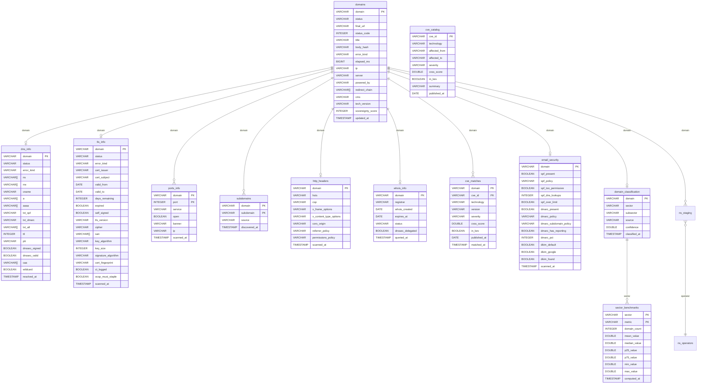

# Database Schema

`helvetiscan` writes into twelve DuckDB tables and exposes one computed view.

## ER Diagram



## Table Reference

### `domains`

Populated by `helvetiscan scan`. One row per input domain.

| Column | Type | Notes |
|---|---|---|
| `domain` | VARCHAR PK | Canonical form, e.g. `example.ch` |
| `status` | VARCHAR | `ok` or `error` |
| `final_url` | VARCHAR | URL after redirect chain |
| `status_code` | INTEGER | Final HTTP status |
| `title` | VARCHAR | Extracted `<title>` text |
| `body_hash` | VARCHAR | MD5 of the truncated response body |
| `error_kind` | VARCHAR | See error kinds below |
| `elapsed_ms` | BIGINT | Total request time in ms |
| `ip` | VARCHAR | Resolved IP used for the request |
| `server` | VARCHAR | `Server:` response header |
| `powered_by` | VARCHAR | `X-Powered-By:` response header |
| `redirect_chain` | VARCHAR[] | Starting URL(s) when a redirect occurred |
| `cms` | VARCHAR | Detected CMS (WordPress, Drupal, Joomla, TYPO3, Wix) |
| `tech_version` | VARCHAR | Extracted version string (e.g. `6.4.2`, `2.4.57`) — from `<meta generator>`, `Server:`, or `X-Powered-By:` |
| `sovereignty_score` | INTEGER | DNS sovereignty tier: 0=CH, 1=EU, 2=non-EU foreign, 3=US |
| `updated_at` | TIMESTAMP | Last scan time |

### `dns_info`

Populated by `helvetiscan dns`. Parallel A/AAAA/NS/MX/CNAME/TXT/CAA/DMARC/DNSKEY/DS/PTR lookups via Cloudflare.

| Column | Type | Notes |
|---|---|---|
| `domain` | VARCHAR PK | |
| `status` | VARCHAR | `ok` or `error` |
| `error_kind` | VARCHAR | See error kinds below |
| `ns` | VARCHAR[] | Nameserver hostnames |
| `mx` | VARCHAR[] | Mail exchanger hostnames |
| `cname` | VARCHAR | First CNAME target, if any |
| `a` | VARCHAR[] | IPv4 addresses |
| `aaaa` | VARCHAR[] | IPv6 addresses |
| `txt_spf` | VARCHAR | First TXT record starting with `v=spf1` |
| `txt_dmarc` | VARCHAR | First TXT record from `_dmarc.<domain>` |
| `txt_all` | VARCHAR[] | All TXT records (unfiltered) |
| `ttl` | INTEGER | Not yet populated (reserved) |
| `ptr` | VARCHAR | Reverse DNS of first resolved IP |
| `dnssec_signed` | BOOLEAN | True if DNSKEY or DS records exist |
| `dnssec_valid` | BOOLEAN | Reserved — chain validation not yet implemented |
| `caa` | VARCHAR[] | CAA records, e.g. `0 issue letsencrypt.org` |
| `wildcard` | BOOLEAN | True if `*.domain` A lookup resolves |
| `resolved_at` | TIMESTAMP | |

### `tls_info`

Populated by `helvetiscan tls`. Raw TLS handshake via `tokio-rustls`; cert parsed by `x509-parser`.

| Column | Type | Notes |
|---|---|---|
| `domain` | VARCHAR PK | |
| `status` | VARCHAR | `ok` or `error` |
| `error_kind` | VARCHAR | See error kinds below |
| `cert_issuer` | VARCHAR | Issuer DN |
| `cert_subject` | VARCHAR | Subject DN |
| `valid_from` | DATE | |
| `valid_to` | DATE | |
| `days_remaining` | INTEGER | Computed at scan time |
| `expired` | BOOLEAN | |
| `self_signed` | BOOLEAN | Issuer == Subject |
| `tls_version` | VARCHAR | e.g. `TLSv1.3` |
| `cipher` | VARCHAR | Negotiated cipher suite |
| `san` | VARCHAR[] | Subject Alternative Names (DNS names + IPs) |
| `key_algorithm` | VARCHAR | `RSA`, `P-256`, `Ed25519`, etc. |
| `key_size` | INTEGER | Key size in bits |
| `signature_algorithm` | VARCHAR | e.g. `SHA256withRSA`, `SHA256withECDSA` |
| `cert_fingerprint` | VARCHAR | SHA-256 hex fingerprint of the DER cert |
| `ct_logged` | BOOLEAN | True if SCT list extension (OID 1.3.6.1.4.1.11129.2.4.2) present |
| `ocsp_must_staple` | BOOLEAN | True if TLS Feature extension requests status_request (feature 5) |
| `scanned_at` | TIMESTAMP | |

### `ports_info`

Populated by `helvetiscan ports`. Normalized: one row per `(domain, port)`. Primary key is `(domain, port)`.

Ports probed: **80, 443, 22, 21, 25, 587, 3306, 5432, 6379, 8080, 8443, 23, 445, 3389, 5900, 9200, 27017, 11211, 2375, 6443**

| Column | Type | Notes |
|---|---|---|
| `domain` | VARCHAR PK | |
| `port` | INTEGER PK | TCP port number |
| `service` | VARCHAR | Human name: `ssh`, `http`, `mysql`, etc. |
| `open` | BOOLEAN | True = TCP connect succeeded |
| `banner` | VARCHAR | First line grabbed from open service (ports 22, 23, 25, 587, 9200, 27017, 11211) |
| `ip` | VARCHAR | Resolved IP (same for all ports of a domain) |
| `scanned_at` | TIMESTAMP | |

### `subdomains`

Populated by `helvetiscan subdomains`. Composite primary key on `(domain, subdomain)`.

| Column | Type | Notes |
|---|---|---|
| `domain` | VARCHAR PK | Parent domain |
| `subdomain` | VARCHAR PK | Discovered FQDN |
| `source` | VARCHAR | `axfr` (zone transfer) or `mx_ns` (record harvest) |
| `discovered_at` | TIMESTAMP | |

### `http_headers`

Populated by `helvetiscan scan` — extracted from the same HTTP response, zero extra requests.

| Column | Type | Notes |
|---|---|---|
| `domain` | VARCHAR PK | |
| `hsts` | VARCHAR | `Strict-Transport-Security` header value |
| `csp` | VARCHAR | `Content-Security-Policy` header value |
| `x_frame_options` | VARCHAR | `X-Frame-Options` header value |
| `x_content_type_options` | VARCHAR | `X-Content-Type-Options` header value |
| `cors_origin` | VARCHAR | `Access-Control-Allow-Origin` header value |
| `referrer_policy` | VARCHAR | `Referrer-Policy` header value |
| `permissions_policy` | VARCHAR | `Permissions-Policy` header value |
| `scanned_at` | TIMESTAMP | |

### `whois_info`

Populated by `helvetiscan whois`. TCP query to `whois.nic.ch:43`.

| Column | Type | Notes |
|---|---|---|
| `domain` | VARCHAR PK | |
| `registrar` | VARCHAR | Registrar name |
| `whois_created` | DATE | First registration date |
| `expires_at` | DATE | Expiration date — compute days live: `expires_at - CURRENT_DATE` |
| `status` | VARCHAR | Domain state, e.g. `Active` |
| `dnssec_delegated` | BOOLEAN | True if `DNSSEC: signed delegation` |
| `queried_at` | TIMESTAMP | |

### `cve_catalog`

Populated by `helvetiscan update-cves`. Local CVE database seeded from the CISA Known Exploited Vulnerabilities (KEV) feed. One row per CVE entry per technology.

| Column | Type | Notes |
|---|---|---|
| `cve_id` | VARCHAR PK | e.g. `CVE-2023-1234` |
| `technology` | VARCHAR | Normalised name: `wordpress`, `drupal`, `joomla`, `typo3`, `apache`, `nginx`, `php`, `openssl` |
| `affected_from` | VARCHAR | Version range start (inclusive) |
| `affected_to` | VARCHAR | Version range end (inclusive) |
| `severity` | VARCHAR | `CRITICAL`, `HIGH`, `MEDIUM`, `LOW` |
| `cvss_score` | DOUBLE | CVSS v3 base score |
| `in_kev` | BOOLEAN | True if listed in CISA KEV catalog |
| `summary` | VARCHAR | Short description |
| `published_at` | DATE | NVD publication date |

### `cve_matches`

Populated after each `scan` run via a SQL JOIN between `domains` and `cve_catalog`. Composite primary key on `(domain, cve_id)`.

| Column | Type | Notes |
|---|---|---|
| `domain` | VARCHAR PK | |
| `cve_id` | VARCHAR PK | |
| `technology` | VARCHAR | Matched technology name |
| `version` | VARCHAR | Version string detected on the domain |
| `severity` | VARCHAR | From `cve_catalog` |
| `cvss_score` | DOUBLE | From `cve_catalog` |
| `in_kev` | BOOLEAN | True if in CISA KEV catalog |
| `published_at` | DATE | From `cve_catalog` |
| `matched_at` | TIMESTAMP | Time of match |

```sql
-- Domains running software with critical KEV-listed CVEs
SELECT domain, technology, version, cve_id, cvss_score
FROM cve_matches
WHERE in_kev = true AND severity = 'CRITICAL'
ORDER BY cvss_score DESC;
```

### `email_security`

Populated by `helvetiscan dns` — parsed from the SPF/DMARC records already collected, plus DKIM selector probes. Zero extra network passes beyond the DNS scan.

| Column | Type | Notes |
|---|---|---|
| `domain` | VARCHAR PK | |
| `spf_present` | BOOLEAN | True if a `v=spf1` TXT record exists |
| `spf_policy` | VARCHAR | The `all` mechanism qualifier: `+all`, `~all`, `-all`, `?all` |
| `spf_too_permissive` | BOOLEAN | True if qualifier is `+` or `?` |
| `spf_dns_lookups` | INTEGER | Count of DNS-consuming mechanisms (`include:`, `a`, `mx`, `redirect=`, `exists:`) |
| `spf_over_limit` | BOOLEAN | True if `spf_dns_lookups > 10` (RFC 7208 §4.6.4) |
| `dmarc_present` | BOOLEAN | True if a `_dmarc.` TXT record exists |
| `dmarc_policy` | VARCHAR | `p=` tag value: `none`, `quarantine`, `reject` |
| `dmarc_subdomain_policy` | VARCHAR | `sp=` tag value, if set |
| `dmarc_has_reporting` | BOOLEAN | True if `rua=` tag present |
| `dmarc_pct` | INTEGER | `pct=` value (default 100 if absent) |
| `dkim_default` | BOOLEAN | True if `default._domainkey.<domain>` resolves with a `v=DKIM1` record |
| `dkim_google` | BOOLEAN | True if `google._domainkey.<domain>` resolves |
| `dkim_found` | BOOLEAN | True if any DKIM selector was found |
| `scanned_at` | TIMESTAMP | |

```sql
-- Domains that allow anyone to send email on their behalf
SELECT domain, spf_policy FROM email_security WHERE spf_too_permissive = true;

-- DMARC with no enforcement
SELECT domain, dmarc_policy FROM email_security WHERE dmarc_policy = 'none' OR NOT dmarc_present;

-- SPF over DNS lookup limit
SELECT domain, spf_dns_lookups FROM email_security WHERE spf_over_limit = true;
```

### `domain_classification`

Populated by `helvetiscan classify`. Assigns each domain to an industry sector using keyword heuristics against the domain name and page title.

| Column | Type | Notes |
|---|---|---|
| `domain` | VARCHAR PK | |
| `sector` | VARCHAR | e.g. `finance`, `healthcare`, `government`, `education`, `legal`, `retail`, `media`, `pharma` |
| `subsector` | VARCHAR | Optional sub-category, e.g. `banking`, `insurance` |
| `source` | VARCHAR | Classification method: `keyword` |
| `confidence` | DOUBLE | Heuristic confidence score 0.0–1.0 |
| `classified_at` | TIMESTAMP | |

```sql
-- Sector breakdown
SELECT sector, COUNT(*) AS domains FROM domain_classification GROUP BY sector ORDER BY domains DESC;
```

### `sector_benchmarks`

Populated by `helvetiscan benchmark`. Stores aggregate statistics for each sector × metric combination.

| Column | Type | Notes |
|---|---|---|
| `sector` | VARCHAR PK | Industry sector from `domain_classification` |
| `metric` | VARCHAR PK | `risk_score`, `hsts_adoption`, `dnssec_adoption`, `dmarc_weak_pct` |
| `domain_count` | INTEGER | Number of domains in this sector |
| `mean_value` | DOUBLE | Mean value of the metric |
| `median_value` | DOUBLE | Median (P50) value |
| `p25_value` | DOUBLE | 25th percentile |
| `p75_value` | DOUBLE | 75th percentile |
| `min_value` | DOUBLE | Minimum value |
| `max_value` | DOUBLE | Maximum value |
| `computed_at` | TIMESTAMP | Last computation time |

```sql
-- Compare risk scores across sectors
SELECT sector, domain_count, median_value AS median_risk
FROM sector_benchmarks WHERE metric = 'risk_score'
ORDER BY median_value ASC;
```

## `risk_score` View

Computed on demand — no storage, always reflects the latest data. JOINs all tables.

```sql
SELECT * FROM risk_score LIMIT 10;
```

| Column | Type | Logic |
|---|---|---|
| `domain` | VARCHAR | |
| `missing_hsts` | BOOLEAN | HSTS header absent on HTTP 200 responses |
| `missing_csp` | BOOLEAN | CSP header absent on HTTP 200 responses |
| `missing_caa` | BOOLEAN | No CAA records |
| `weak_tls` | BOOLEAN | TLSv1.0/1.1 or expired cert |
| `cert_expired` | BOOLEAN | Certificate past `valid_to` |
| `cert_expiring` | BOOLEAN | `days_remaining` between 0 and 29 |
| `no_dnssec` | BOOLEAN | No DNSKEY/DS records |
| `no_dmarc` | BOOLEAN | No `_dmarc.` TXT record (replaced by `dmarc_weak` once email_security is populated) |
| `domain_expiring` | BOOLEAN | Domain expires within 30 days |
| `exposed_db_port` | BOOLEAN | Open port in (3306, 5432, 6379, 9200, 27017, 11211, 2375) |
| `exposed_risky_port` | BOOLEAN | Open port in (445, 23, 3389, 5900) |
| `has_critical_cve` | BOOLEAN | At least one `CRITICAL` CVE match in `cve_matches` |
| `spf_permissive` | BOOLEAN | SPF `+all` or `?all` — anyone can send email as this domain |
| `dmarc_weak` | BOOLEAN | DMARC `p=none` or absent |
| `no_dkim` | BOOLEAN | No DKIM selector found |
| `sovereignty_score` | INTEGER | Copied from `domains.sovereignty_score` |
| `sovereignty_penalty` | INTEGER | Score deduction from sovereignty tier (0, −1, −3, or −5) |
| `score` | INTEGER | 0–100; starts at 100, deducted per flag |

Score deductions: missing_hsts −10, missing_csp −10, missing_caa −8, weak_tls −10, cert_expired −20, cert_expiring −15, no_dnssec −5, no_dmarc −7, domain_expiring −5, exposed_db_port −10, exposed_risky_port −10, has_critical_cve −15, spf_permissive −7, dmarc_weak −7 (replaces no_dmarc when email_security exists), no_dkim −5, sovereignty EU −1 / non-EU −3 / US −5.

### Example queries

```sql
-- Worst-scoring domains
SELECT domain, score FROM risk_score ORDER BY score ASC LIMIT 20;

-- Domains with exposed database ports
SELECT domain, score FROM risk_score WHERE exposed_db_port = true ORDER BY domain;

-- Missing both HSTS and CSP
SELECT domain FROM risk_score WHERE missing_hsts AND missing_csp;

-- Certs expiring in 7 days
SELECT t.domain, t.days_remaining, t.cert_issuer
FROM tls_info t
WHERE t.days_remaining BETWEEN 0 AND 7
ORDER BY t.days_remaining;

-- Domains with open Redis or MySQL
SELECT domain, port, service
FROM ports_info
WHERE open = true AND port IN (3306, 6379)
ORDER BY domain;

-- Registrar breakdown
SELECT registrar, COUNT(*) AS domains
FROM whois_info
WHERE registrar IS NOT NULL
GROUP BY registrar
ORDER BY domains DESC;
```

### `ns_staging`

Populated by `helvetiscan sovereignty`. Staging table mapping each domain to its NS operator(s). Rebuilt on every `sovereignty` run.

| Column | Type | Notes |
|---|---|---|
| `domain` | VARCHAR PK | |
| `operator` | VARCHAR PK | Normalised operator name, e.g. `Cloudflare`, `Infomaniak` |

### `ns_operators`

Populated by `helvetiscan sovereignty`. One row per distinct NS operator, enriched with ASN and jurisdiction data from GeoLite2 mmdb files.

| Column | Type | Notes |
|---|---|---|
| `operator` | VARCHAR PK | Normalised operator name |
| `sample_ns` | VARCHAR | Representative NS hostname used for IP resolution |
| `resolved_ip` | VARCHAR | Resolved IPv4/IPv6 of `sample_ns` |
| `asn` | VARCHAR | AS number string, e.g. `AS13335` |
| `asn_org` | VARCHAR | ASN organisation name |
| `country_code` | VARCHAR | ISO 3166-1 alpha-2, e.g. `CH`, `US`, `DE` |
| `jurisdiction` | VARCHAR | `CH`, `EU`, `US`, or `OTHER` |
| `updated_at` | TIMESTAMP | |

```sql
-- Which NS operators control the most .ch domains?
SELECT operator, jurisdiction, COUNT(DISTINCT ns.domain) AS domains
FROM ns_staging ns
JOIN ns_operators o ON ns.operator = o.operator
GROUP BY operator, jurisdiction
ORDER BY domains DESC
LIMIT 20;

-- What share of .ch domains depends on non-Swiss DNS?
SELECT jurisdiction, COUNT(DISTINCT ns.domain) AS domains,
       ROUND(100.0 * COUNT(DISTINCT ns.domain) / (SELECT COUNT(*) FROM domains), 1) AS pct
FROM ns_staging ns
JOIN ns_operators o ON ns.operator = o.operator
GROUP BY jurisdiction ORDER BY domains DESC;
```

## Error Kinds

| Value | Meaning |
|---|---|
| `dns` | DNS resolution failed |
| `refused` | Connection refused |
| `tls_failed` | TLS handshake error |
| `timeout` | Connect or request timed out |
| `not_found` | No records / 404 |
| `parse_failed` | Could not parse response |
| `http_status` | Unexpected HTTP status |
| `other` | Uncategorised error |

## CLI Subcommands & `--full` Shortcuts

| Subcommand | `--full` target | Description |
|---|---|---|
| `init` | — | Load domain list into DuckDB |
| `scan` | `--full domain` | HTTP fetch + security headers + CMS/version detection + CVE matching |
| `dns` | `--full dns` | DNS metadata (A/AAAA/NS/MX/TXT/CAA/DNSSEC/wildcard) + SPF/DMARC/DKIM analysis → `email_security` |
| `tls` | `--full tls` | TLS cert + version + key info + fingerprint |
| `ports` | `--full ports` | TCP port probes + banner grabbing (20 ports) |
| `subdomains` | `--full subdomains` | CT logs + AXFR + NS/MX subdomain harvest |
| `whois` | `--full whois` | WHOIS query to whois.nic.ch (rate-limited, run separately) |
| `update-cves` | — | Download CISA KEV feed, populate `cve_catalog`, match against `domains` |
| `classify` | — | Classify domains by sector using keyword heuristics → `domain_classification` |
| `benchmark` | — | Compute sector-level risk benchmarks → `sector_benchmarks` |
| `sovereignty` | — | Map NS operators to jurisdictions via GeoLite2 → `ns_staging`, `ns_operators`, `domains.sovereignty_score` |
| — | `--full all` | Run scan → dns → tls → ports → subdomains in sequence |

`--full all` intentionally excludes `whois`, `update-cves`, `classify`, and `benchmark` — these are slower or post-processing steps. Run them separately.

Single-domain shortcut: `helvetiscan --domain example.ch --all`
