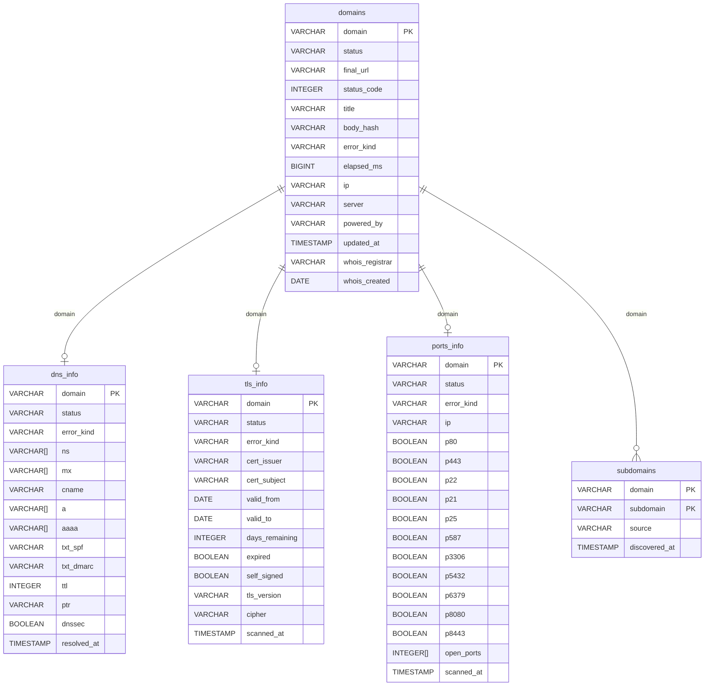

# Database Schema

`helvetiscan` writes into five DuckDB tables, each populated by its own subcommand.

## ER Diagram



## Table Reference

### `domains`

Populated by `helvetiscan scan`. One row per input domain.

| Column | Type | Notes |
|---|---|---|
| `domain` | VARCHAR PK | Canonical form, e.g. `example.ch` |
| `status` | VARCHAR | `ok` or `error` |
| `final_url` | VARCHAR | URL after redirect chain |
| `status_code` | INTEGER | Final HTTP status |
| `title` | VARCHAR | Extracted `<title>` text |
| `body_hash` | VARCHAR | MD5 of the truncated response body |
| `error_kind` | VARCHAR | See error kinds below |
| `elapsed_ms` | BIGINT | Total request time in ms |
| `ip` | VARCHAR | Resolved IP used for the request |
| `server` | VARCHAR | `Server:` response header |
| `powered_by` | VARCHAR | `X-Powered-By:` response header |
| `updated_at` | TIMESTAMP | Last scan time |
| `whois_registrar` | VARCHAR | Registrar name from whois.nic.ch |
| `whois_created` | DATE | First registration date (`before YYYY-MM-DD` stored as date) |

### `dns_info`

Populated by `helvetiscan dns`. Parallel A/AAAA/NS/MX/CNAME/TXT/DMARC/DNSKEY/DS/PTR lookups via Cloudflare.

| Column | Type | Notes |
|---|---|---|
| `domain` | VARCHAR PK | |
| `status` | VARCHAR | `ok` or `error` |
| `error_kind` | VARCHAR | See error kinds below |
| `ns` | VARCHAR[] | Nameserver hostnames |
| `mx` | VARCHAR[] | Mail exchanger hostnames |
| `cname` | VARCHAR | First CNAME target, if any |
| `a` | VARCHAR[] | IPv4 addresses |
| `aaaa` | VARCHAR[] | IPv6 addresses |
| `txt_spf` | VARCHAR | First TXT record starting with `v=spf1` |
| `txt_dmarc` | VARCHAR | First TXT record from `_dmarc.<domain>` |
| `ttl` | INTEGER | Not yet populated (reserved) |
| `ptr` | VARCHAR | Reverse DNS of first resolved IP |
| `dnssec` | BOOLEAN | True if DNSKEY or DS records exist |
| `resolved_at` | TIMESTAMP | |

### `tls_info`

Populated by `helvetiscan tls`. Raw TLS handshake via `tokio-rustls`; cert parsed by `x509-parser`.

| Column | Type | Notes |
|---|---|---|
| `domain` | VARCHAR PK | |
| `status` | VARCHAR | `ok` or `error` |
| `error_kind` | VARCHAR | See error kinds below |
| `cert_issuer` | VARCHAR | Issuer DN |
| `cert_subject` | VARCHAR | Subject DN |
| `valid_from` | DATE | |
| `valid_to` | DATE | |
| `days_remaining` | INTEGER | Computed at scan time |
| `expired` | BOOLEAN | |
| `self_signed` | BOOLEAN | Issuer == Subject |
| `tls_version` | VARCHAR | e.g. `TLSv1.3` |
| `cipher` | VARCHAR | Negotiated cipher suite |
| `scanned_at` | TIMESTAMP | |

### `ports_info`

Populated by `helvetiscan ports`. Async TCP connect probes on 11 ports.

Ports probed: **80, 443, 22, 21, 25, 587, 3306, 5432, 6379, 8080, 8443**

| Column | Type | Notes |
|---|---|---|
| `domain` | VARCHAR PK | |
| `status` | VARCHAR | `ok` or `error` |
| `error_kind` | VARCHAR | See error kinds below |
| `ip` | VARCHAR | Resolved IP used for probes |
| `p80` … `p8443` | BOOLEAN | True = port open |
| `open_ports` | INTEGER[] | List of all open port numbers |
| `scanned_at` | TIMESTAMP | |

### `subdomains`

Populated by `helvetiscan subdomains`. Composite primary key on `(domain, subdomain)`.

| Column | Type | Notes |
|---|---|---|
| `domain` | VARCHAR PK | Parent domain |
| `subdomain` | VARCHAR PK | Discovered FQDN |
| `source` | VARCHAR | `axfr` (zone transfer) or `mx_ns` (record harvest) |
| `discovered_at` | TIMESTAMP | |

## Error Kinds

| Value | Meaning |
|---|---|
| `dns` | DNS resolution failed |
| `refused` | Connection refused |
| `tls_failed` | TLS handshake error |
| `timeout` | Connect or request timed out |
| `not_found` | No records / 404 |
| `parse_failed` | Could not parse response |
| `http_status` | Unexpected HTTP status |
| `other` | Uncategorised error |

## CLI Subcommands & `--full` Shortcuts

| Subcommand | `--full` target | Description |
|---|---|---|
| `init` | — | Load domain list into DuckDB |
| `scan` | `--full domain` | HTTP fetch (status, title, server headers) |
| `dns` | `--full dns` | DNS metadata |
| `tls` | `--full tls` | TLS cert + version info |
| `ports` | `--full ports` | TCP port probes |
| `subdomains` | `--full subdomains` | AXFR + NS/MX subdomain harvest |
| `whois` | — | WHOIS registrar + registration date (whois.nic.ch, port 43) |
| — | `--full all` | Run scan → dns → tls → ports in sequence |

Single-domain shortcut: `helvetiscan --domain example.ch --all`

## Useful Queries

```sql
-- Domains with live HTTP responses but no title.
SELECT domain, final_url, status_code
FROM domains
WHERE status_code = 200
  AND (title IS NULL OR title = '')
ORDER BY domain;

-- Domains with no DNS metadata yet.
SELECT d.domain
FROM domains d
LEFT JOIN dns_info i ON i.domain = d.domain
WHERE i.domain IS NULL
ORDER BY d.domain
LIMIT 100;

-- Certificates expiring in the next 14 days.
SELECT domain, cert_issuer, valid_to, days_remaining
FROM tls_info
WHERE days_remaining IS NOT NULL
  AND days_remaining BETWEEN 0 AND 14
ORDER BY days_remaining, domain;

-- Domains exposing non-web service ports.
SELECT domain, open_ports
FROM ports_info
WHERE p22 OR p21 OR p25 OR p587 OR p3306 OR p5432 OR p6379
ORDER BY domain;

-- Domains with open Redis (6379) or MySQL (3306).
SELECT domain, ip, p3306, p6379
FROM ports_info
WHERE p3306 OR p6379
ORDER BY domain;

-- Join everything into one flat view.
SELECT
    d.domain,
    d.status_code,
    d.title,
    d.server,
    d.ip,
    dns.a,
    dns.ns,
    tls.cert_issuer,
    tls.days_remaining,
    p.open_ports
FROM domains d
LEFT JOIN dns_info  dns ON dns.domain = d.domain
LEFT JOIN tls_info  tls ON tls.domain = d.domain
LEFT JOIN ports_info p  ON p.domain   = d.domain
ORDER BY d.domain
LIMIT 100;

-- Subdomains discovered via zone transfer.
SELECT domain, subdomain, discovered_at
FROM subdomains
WHERE source = 'axfr'
ORDER BY domain, subdomain;

-- Domains grouped by registrar.
SELECT whois_registrar, COUNT(*) AS domains
FROM domains
WHERE whois_registrar IS NOT NULL
GROUP BY whois_registrar
ORDER BY domains DESC;
```
