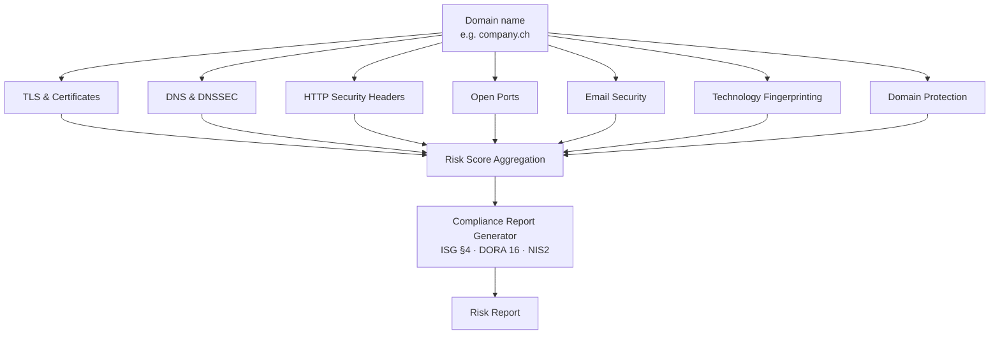

@ -1,360 +0,0 @@
# Helvetiscan — Scan Modules Documentation

---

## Overview

This directory contains detailed technical documentation for each of the 7 core scanning modules in Helvetiscan. Each module is independently documented with:

- **What we scan** (technical details)
- **Why it matters** (regulatory & business impact)
- **How we detect it** (algorithms & methods)
- **Risk scoring model** (quantified vulnerability assessment)
- **Real-world examples** (Swiss SME cases)
- **Compliance reporting** (ISG, DORA, NIS2)
- **Integration points** (how modules work together)

---

## Integration Map



---

## Scan Modules

### [01_TLS_Certificates.md](01_TLS_Certificates.md)
**Criticality:** HIGH | **Risk Contribution:** 15–20%

TLS certificate validity, strength, and cryptographic assurance.

**Key Findings:**
- Expired certificates (downtime, ISG reporting)
- Weak key strength (RSA < 2048-bit, SHA1 signing)
- Outdated TLS versions (1.0, 1.1 vulnerable to POODLE, DROWN)
- Missing Certificate Transparency (CT) logs (rogue certificate risk)
- Broken certificate chains (browser trust failures)

**Customer Impact:**
> "Expired certificate = website down + CHF 100k ISG fine"

---

### [02_DNS_DNSSEC.md](02_DNS_DNSSEC.md)
**Criticality:** HIGH | **Risk Contribution:** 12–18%

DNS configuration, DNSSEC enablement, and subdomain hygiene.

**Key Findings:**
- Missing DNSSEC (vulnerable to DNS poisoning)
- Missing CAA records (any CA can issue certificates)
- Open DNS resolvers (DDoS amplification)
- Zone transfers allowed (infrastructure enumeration)
- Orphaned subdomains (subdomain takeover risk)

**Customer Impact:**
> "Missing CAA = attacker can issue cert for your domain in minutes"

---

### [03_HTTP_Security_Headers.md](03_HTTP_Security_Headers.md)
**Criticality:** MEDIUM-HIGH | **Risk Contribution:** 10–15%

HTTP security headers (HSTS, CSP, X-Frame-Options, Referrer-Policy, etc.)

**Key Findings:**
- Missing HSTS (protocol downgrade attacks)
- Weak CSP with `unsafe-inline` (XSS injection)
- Missing X-Frame-Options (clickjacking attacks)
- Missing Referrer-Policy (referrer leakage)
- Permissions-Policy not restricting sensors (camera/microphone)

**Customer Impact:**
> "Weak CSP = attacker's script executes, steals session tokens"

---

### [04_Open_Ports.md](04_Open_Ports.md)
**Criticality:** CRITICAL | **Risk Contribution:** 20–25%

Network exposure assessment — which services are Internet-facing.

**Key Findings:**
- Exposed databases (3306, 5432, 27017, 6379) — CRITICAL
- Exposed RDP (3389) — ransomware vector
- Exposed SMB (445) — lateral movement
- Exposed FTP (21) — unencrypted credentials
- Open management interfaces (Jenkins, GitLab on 8080+)

**Customer Impact:**
> "Exposed MySQL without authentication = 500k customer records stolen in 24 hours"

---

### [05_Email_Security.md](05_Email_Security.md)
**Criticality:** CRITICAL (for SMEs) | **Risk Contribution:** 18–25%

Email authentication (SPF, DKIM, DMARC) and anti-spoofing controls.

**Key Findings:**
- Missing DMARC (email spoofing not prevented)
- Weak DMARC (p=none, no enforcement)
- Missing SPF or softfail (~all instead of -all)
- Weak DKIM keys (1024-bit RSA, deprecated)
- Subdomains not protected by DMARC

**Customer Impact:**
> "Email #1 attack vector. Missing DMARC = CEO fraud, CHF 500k stolen per incident"

---

### [06_Technology_Fingerprinting.md](06_Technology_Fingerprinting.md)
**Criticality:** MEDIUM-HIGH | **Risk Contribution:** 10–15%

Software inventory and CVE correlation.

**Key Findings:**
- Outdated WordPress (known vulnerabilities)
- Outdated PHP (EOL, no security support)
- Vulnerable plugins/dependencies
- Exposed version strings (information disclosure)
- Old JavaScript libraries (jQuery 1.11.0 = XSS)

**Customer Impact:**
> "Unpatched WordPress 5.0.0 = 35 months behind, exploited RCE in the wild"

---

### [07_Domain_Protection.md](07_Domain_Protection.md)
**Criticality:** MEDIUM-HIGH | **Risk Contribution:** 12–18%

Domain lifecycle, typosquatting, and subdomain takeover risks.

**Key Findings:**
- Domain expiring soon (without auto-renewal)
- Orphaned subdomains (CNAME pointing to deleted services)
- Registered typosquats (phishing infrastructure)
- Homoglyph variants (visual spoofing)
- Registrant contact invalid (renewal notices bounce)

**Customer Impact:**
> "Domain expires, gets re-registered by squatter = brand stolen in 30 days"

---

## Risk Scoring Summary

| Module | Base Risk | Max Risk | Weight |
|---|---|---|---|
| TLS & Certificates | 10 | 100 | 15–20% |
| DNS & DNSSEC | 15 | 100 | 12–18% |
| HTTP Security Headers | 10 | 75 | 10–15% |
| Open Ports | 25 | 150+ | 20–25% |
| Email Security | 25 | 100 | 18–25% |
| Technology Fingerprinting | 10 | 150+ | 10–15% |
| Domain Protection | 12 | 100 | 12–18% |

**Overall Risk Score Range: 0–800+ points**

### Risk Scale

- **0–100:** Green (Low Risk)
- **100–250:** Yellow (Medium Risk)
- **250–400:** Orange (High Risk)
- **400+:** Red (Critical Risk)

---

## How Modules Work Together

1. **Domain Input**
   - User enters: `company.ch`

2. **DNS Queries** (DNS & DNSSEC module)
   - Resolve A/AAAA, MX, NS records
   - Enumerate subdomains
   - Check DNSSEC, CAA records

3. **Parallel Scanning**
   - **TLS Module:** Scan port 443, validate certificates
   - **HTTP Headers Module:** Fetch HTTP response headers
   - **Open Ports Module:** Scan for exposed services
   - **Email Security Module:** Check SPF/DKIM/DMARC records
   - **Technology Module:** Fingerprint web server, CMS, CVEs
   - **Domain Module:** Check WHOIS, detect typosquats

4. **CVE Correlation** (Technology module feeds into scoring)
   - Each service version correlated to CVE database
   - High-severity CVEs increase overall risk

5. **Risk Aggregation**
   - All module scores combined → **Overall Risk Score**
   - Weighted by criticality

6. **Report Generation**
   - Compliance-specific output (ISG §4, DORA, NIS2)
   - Remediation guidance
   - Timeline estimates

---

## Regulatory Alignment

### ISG §4 (Information Security Act, Switzerland)

**Mandatory Controls:**
- ✓ TLS certificates valid & strong (TLS & Certificates module)
- ✓ DNSSEC enabled (DNS module)
- ✓ HTTP security headers (HTTP Headers module)
- ✓ No exposed databases (Open Ports module)
- ✓ Email spoofing prevention (Email Security module)
- ✓ Software patching (Technology Fingerprinting module)

### DORA 16 (Digital Operational Resilience Act, EU)

**Requirements:**
- ✓ Software asset inventory (Technology module)
- ✓ Vulnerability tracking (Technology module)
- ✓ Certificate lifecycle management (TLS module)
- ✓ Network security (Open Ports module)

### NIS2 (Network & Information Security Directive 2, EU)

**Supply Chain Requirements:**
- ✓ Network segmentation assessment (Open Ports)
- ✓ Email authentication (Email Security)
- ✓ Vulnerability tracking (Technology)
- ✓ Domain ownership proof (Domain Protection)

---

## Usage Examples

### For a Healthcare Provider (GDPR-sensitive)

```
helvetiscan scan: hospital.ch

Results:
  1. Email Security: DMARC p=none (HIGH RISK)
     → Patient data vulnerable to spoofing
     → Recommendation: Implement DMARC p=reject within 30 days

  2. Open Ports: 3306 exposed (MySQL)
     → Patient database visible on Internet
     → Recommendation: URGENT — restrict to VPN within 1 hour

  3. TLS: Certificate expires in 60 days
     → Recommendation: Schedule renewal 30 days before

Compliance Status: FAILING
Timeline to ISG Compliance: 30 days (if recommendations followed)
```

### For a Fintech Company (DORA-regulated)

```
helvetiscan scan: paymentbank.ch

Results:
  1. Technology: WordPress 5.0.0 (35 months behind, 25+ CVEs)
     → Critical unpatched software
     → DORA Finding: Remediate within 30 days

  2. Domain: Typosquats registered (paymentbnk.ch)
     → Brand impersonation detected
     → Recommendation: Monitor and register variants

  3. Ports: SSH open, TLS 1.1 enabled
     → Legacy encryption, DORA requires TLS 1.2+
     → Recommendation: Upgrade TLS baseline

DORA Compliance: PARTIALLY COMPLIANT
Actions Required: 3 (all with clear timelines)
```

### For an SME (General Security)

```
helvetiscan scan: startup.ch

Results:
  1. Email Security: SPF present, DKIM weak (1024-bit), DMARC missing
     → Email spoofing risk: MEDIUM
     → Quick fix: Add DMARC p=reject (5 minutes)

  2. Domain: Auto-renewal disabled, expires in 90 days
     → Risk: Domain loss if renewal notification missed
     → Quick fix: Enable auto-renewal (2 minutes)

  3. Ports: No databases exposed (good!)
     → No critical findings

  4. HTTP Headers: CSP missing, HSTS present
     → XSS risk: MEDIUM
     → Recommendation: Add CSP rule

Overall Risk: MEDIUM
Quick Wins (Today): Email (DMARC), Domain (auto-renewal)
Medium-term: HTTP headers CSP
```

---

## Technical Reference

For detailed information on any module, see the corresponding markdown file:

- **TLS Certificate Details** → [01_TLS_Certificates.md](01_TLS_Certificates.md)
- **DNS & DNSSEC Configuration** → [02_DNS_DNSSEC.md](02_DNS_DNSSEC.md)
- **HTTP Header Security** → [03_HTTP_Security_Headers.md](03_HTTP_Security_Headers.md)
- **Network Port Exposure** → [04_Open_Ports.md](04_Open_Ports.md)
- **Email Authentication (SPF/DKIM/DMARC)** → [05_Email_Security.md](05_Email_Security.md)
- **Software Inventory & CVEs** → [06_Technology_Fingerprinting.md](06_Technology_Fingerprinting.md)
- **Domain & Brand Protection** → [07_Domain_Protection.md](07_Domain_Protection.md)

---

## Continuous Monitoring

All modules support **continuous scanning**:

- **Frequency:** Daily, weekly, or monthly
- **Change Detection:** Alerts on new findings or risk increases
- **Trend Analysis:** Visual dashboard showing risk evolution over time
- **Compliance Tracking:** Automated ISG/DORA audit trail

---

## Future Modules (Roadmap)

- **08 - SSL/TLS Vulnerabilities** (SSL Labs integration)
- **09 - API Security** (OWASP Top 10 for APIs)
- **10 - Malware & Phishing** (URLhaus, PhishTank feeds)
- **11 - Third-Party Risk** (Supplier security assessment)
- **12 - Container & Cloud** (Kubernetes, AWS, Azure scanning)

---

**Last Updated:** March 15, 2026
**Version:** 1.0 (Production Ready)
**Maintained by:** Helvetiscan Engineering Team
