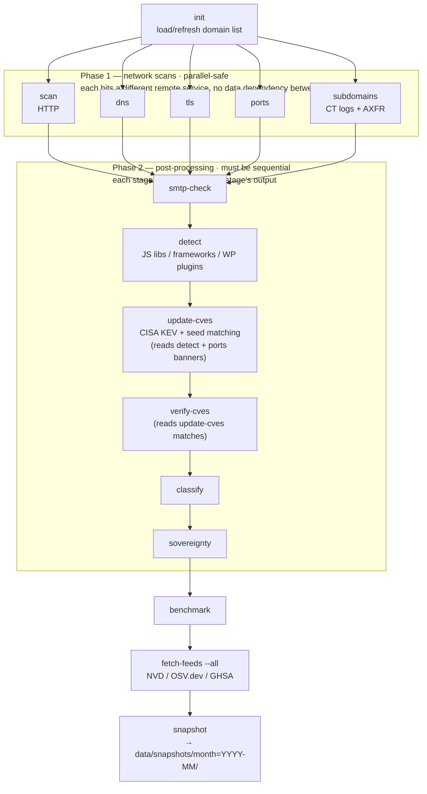

# Monthly Snapshots

`helvetiscan` scans in place — every table is upserted per domain, so re-running a scan module
overwrites whatever was there before. There is no history: a `cve_matches` row from last month
is gone the moment `update-cves` runs again. **Snapshots** are the fix: a dated, read-only,
compressed copy of the risk/tech/CVE-relevant tables, taken monthly, so evolution (and
regression) can be compared across months without touching the live database.

## Design

A snapshot is a Parquet export, not a second copy inside SQLite. `domains.db` stays exactly as
it always has — current-state only, upserted in place by `full`. Nothing about its schema or
size is affected by taking snapshots (aside from one small bookkeeping table, `snapshot_runs`).
The snapshot itself lives entirely as files under `data/snapshots/`.

This was a deliberate choice over SQL history tables (`cve_matches_history` with a
`snapshot_month` column, etc.): Parquet's columnar compression keeps monthly exports small
relative to the live DB, and cross-month analysis happens with Polars/Arrow reading directly
across dated folders — no schema migration, no unbounded growth of the operational database.

## Command

```bash
helvetiscan snapshot --db data/domains.db [--month YYYY-MM] [--output-dir data/snapshots] \
  [--min-coverage PCT] [--verify]
```

- `--month` defaults to the current month.
- Writes to `<output_dir>/month=<YYYY-MM>/` — the `month=` prefix is a
  [Hive-partitioning](https://arrow.apache.org/docs/python/dataset.html#partitioned-datasets)
  convention, so a Polars/Arrow reader gets the month back as a column for free when scanning
  the whole `data/snapshots/` tree. Each table also carries an explicit `month` column of its
  own, as cheap insurance if a single file is ever copied out of its `month=YYYY-MM/` directory.
- Idempotent per month: re-running the same `--month` overwrites that month's directory and its
  `snapshot_runs` row rather than duplicating either.
- `--verify` re-checks an already-written month's files against its manifest's checksums instead
  of exporting a new one — cheap corruption detection for data that can't be re-scanned to check.
- `--min-coverage PCT` refuses to write the snapshot if any module's scan coverage (see below)
  falls below `PCT`. A missing month is more honest than a silently under-scanned one. Without
  it, low coverage is recorded and warned about but never blocks a run.

## What gets exported

Ten tables/views per snapshot, chosen for trend value and to keep exports small — bulky,
low-signal tables (`subdomains`, NS staging tables) are deliberately excluded:

`domains`, `dns_info`, `tls_info`, `ports_info`, `email_security`, `smtp_tls_check`,
`domain_classification`, `cve_matches`, `cve_catalog`, `risk_score` (the computed view,
materialized at export time).

## Output layout

```
data/snapshots/
  month=2026-08/
    domains.parquet
    dns_info.parquet
    tls_info.parquet
    ports_info.parquet
    email_security.parquet
    smtp_tls_check.parquet
    domain_classification.parquet
    cve_matches.parquet
    cve_catalog.parquet
    risk_score.parquet
    manifest.json
    benchmark.log        # per-stage timings, when run via scripts/monthly.sh
```

Export is atomic: each run writes into a sibling `.tmp-month=YYYY-MM-<pid>/` directory first,
then renames it into place with a single `rename()` once every table has been written
successfully — a reader never sees a half-written mix of old and new tables, and a crash
mid-export leaves no visible `month=YYYY-MM/` directory at all rather than a corrupt one.

`manifest.json` is a self-contained, directory-local record of the run — readable without
opening SQLite at all:
- `snapshot_month`, `tool_version`, `started_at`, `finished_at`
- `tables`: per-table `row_count`, `columns`, `file`, and a `sha256` checksum (what `--verify`
  checks against)
- `coverage`: per-module scan coverage (see below)

`snapshot_runs` in `domains.db` is the queryable, cross-month source of truth (`snapshot_month`
PK, `started_at`/`finished_at`, `status` — `running`/`ok`/`failed`, `error`, `output_dir`,
`tables_json`, `row_counts_json`, `columns_json`, `coverage_json`); the manifest is its
self-contained mirror for readers that only have the Parquet files, not the database.

## Coverage metrics

Before any file is written, `snapshot` computes, per scan module, what fraction of domains have
actually been scanned — using the same "missing timestamp means pending" convention the scan
modules themselves use to find pending work:

| module | table | marker column |
|---|---|---|
| http | `domains` | `updated_at` |
| dns | `dns_info` | `resolved_at` |
| tls | `tls_info` | `scanned_at` |
| ports | `domains` | `ports_scanned_at` |
| email_security | `email_security` | `scanned_at` |
| smtp | `smtp_tls_check` | `checked_at` (counts distinct domains — multiple rows per domain) |
| classification | `domain_classification` | `classified_at` |

Each module's coverage reports `scanned`/`total`/`coverage_pct`, an error breakdown by kind
(where the table has an `error_kind`-style column), and the freshest/stalest scan timestamps
seen. Anything below 100% is printed as a warning even when `--min-coverage` isn't set — a full
scan across the whole `.ch` namespace is a multi-day-to-multi-week operation (see
`scripts/monthly.sh` and its `benchmark-*.log` output), so a snapshot taken mid-scan is normal,
not necessarily a bug; coverage numbers make the gap visible instead of silently averaging it
away in `risk_score`.

## Operational workflow

`scripts/monthly.sh` runs the whole monthly cycle: load any newly-registered domains, a full
re-scan, refresh the CVE catalog from every available source (`fetch-feeds --all`, on top of the
CISA KEV feed the scan stages already pull in), then `snapshot`. Each stage is timed into
`logs/benchmark-<YYYY-MM>.log`, which is copied into the snapshot's own directory once it
exists.

### Pipeline shape — what can run in parallel



Phase 1's five modules have no dependency on each other — `scan`, `dns`, `tls`, `ports`, and
`subdomains` each write to their own table and hit a different remote service (HTTP, DNS
resolvers, TLS handshake, arbitrary TCP ports, crt.sh/AXFR), so they're safe to run
concurrently. Phase 2 is a real chain and cannot be parallelized: `detect` needs `scan`'s
`status_code` and must run after `ports` too (CVE matching folds in `ports_info` banners
alongside `detect`'s `software_detections`), `update-cves` needs `detect`'s output,
`verify-cves` needs `update-cves`'s matches, and so on down to `sovereignty`.

### How `scripts/monthly.sh` runs this — `SCAN_MODE`

`helvetiscan full` — the single command meant to run the whole scan pipeline in one process —
hangs at real full-namespace scale (millions of pending domains): the process stays CPU-busy but
stops writing to the database entirely after some minutes. Root cause not yet found; not
reproducible at small scale (e.g. the 5-domain e2e test, or a 1.5M-row synthetic-domain repro
attempt — see task notes). `scripts/monthly.sh` selects how Phase 1 actually runs via
`SCAN_MODE`:

| `SCAN_MODE` | What it does |
|---|---|
| `concurrent` (default) | Each Phase 1 module as its own standalone OS process, all five launched at once against the one WAL database, with a barrier that fails the run if any module fails. Local test (60k synthetic domains): 120.5s vs 474.9s sequential — 3.9x faster, zero write contention/corruption. **Not yet validated at real full-namespace scale (millions of domains).** |
| `sequential` | Each Phase 1 module one after another — the most conservative option, same total-time shape as summing every stage's duration. Use if a concurrent run misbehaves in production. |
| `full` | `helvetiscan full`'s in-process 5-module orchestration — left in for debugging only; do not use for a production run until the hang above is root-caused. |

Phase 2 always runs sequentially regardless of `SCAN_MODE` — there's no dependency structure to
exploit there. The legacy `SEQUENTIAL_SCAN=1`/`SEQUENTIAL_SCAN=0` toggle still works as a
back-compat shim when `SCAN_MODE` is unset. `DOMAINS_LIST` and `PARALLEL_DIVISOR` (the latter
only applies to `SCAN_MODE=full`) are also overridable via environment variables — see the
script's own comments for details.

Snapshots are compact enough to pull back from a scan host to a local machine after each run
(hundreds of MB, not the tens of GB of `domains.db` itself):
```bash
rsync -av <host>:path/to/helvetiscan/data/snapshots/ ./data/snapshots/
```

## Cross-month trend analysis

Snapshots are meant to be read with Polars (or any Arrow-aware tool), not SQL against
`domains.db`. `scripts/snapshot_trend.py` (requires `polars`) reads the tree directly — it never
opens `domains.db`:

```bash
python3 scripts/snapshot_trend.py verify                                    # sanity-check every month present
python3 scripts/snapshot_trend.py cve-diff     --month-a 2026-07 --month-b 2026-08  # CVEs that appeared/disappeared
python3 scripts/snapshot_trend.py domains-diff --month-a 2026-07 --month-b 2026-08  # domains that entered/left
```

`domains-diff` cross-references each month's coverage (from its manifest) so a domain that
"disappeared" because it was never re-scanned that month reads differently from one that
genuinely dropped out of the dataset.

The underlying read pattern, for writing new ad-hoc queries: `pl.scan_parquet` over
`data/snapshots/month=*/<table>.parquet` with `hive_partitioning=True` gets `month` back as a
column for free; `extra_columns="ignore", missing_columns="insert"` handles schema drift across
months as this repo's migrations land, rather than erroring on a column present in one month but
not another.
